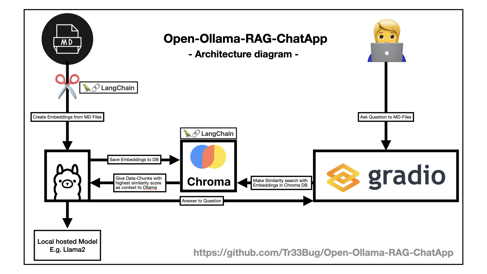

# Ollama RAG Chat App

A chat application using [Ollama](https://ollama.ai/) and Retrieval-Augmented Generation (RAG) for document retrieval and question answering.

## Architecture

This application uses the following components:

- **Ollama**: A lightweight API for running LLMs locally
- **LangChain**: For document processing and RAG implementation
- **ChromaDB**: Vector database for storing document embeddings
- **Gradio**: Web interface for the chat application



## Project Structure

```
.
├── data/                 # Documents to be processed
├── src/                  # Application source code
│   ├── app.py            # Gradio app for the chat interface
│   ├── chat.py           # Chat functionality with Ollama
│   ├── config.py         # Configuration settings
│   ├── document_processor.py # Document loading and processing
│   ├── main.py           # Main entry point
│   ├── update_db.py      # Database update functionality
│   └── vector_db.py      # Vector database interactions
├── tests/                # Tests for the application
│   ├── conftest.py       # Pytest configuration
│   ├── test_document_processor.py
│   ├── test_document_tracker.py
│   └── test_vector_db.py
├── chroma/               # Vector database storage (created at runtime)
└── pyproject.toml        # Python project configuration
```

## Installation

1. Install [Ollama](https://ollama.ai/) and run it locally
2. Install the project dependencies:

```bash
pip install -e .
```

## Usage

### Update the Vector Database

Process documents in the `data/` directory and update the vector database:

```bash
python -m src.main --update-db
```

### Start the Chat Application

Start the chat application:

```bash
python -m src.main
```

Or in one step:

```bash
python -m src.main --update-db
```

### Run Tests

Run the tests using pytest:

```bash
pytest
```

## Configuration

Configuration settings are in `src/config.py`. You can modify:

- `DATA_PATH`: Path to the documents directory
- `CHROMA_PATH`: Path to the vector database
- `OLLAMA_MODEL`: The Ollama model to use
- `OLLAMA_URL`: URL of the Ollama server
- Text splitting and chunking parameters

## License

MIT License - See LICENSE file for details